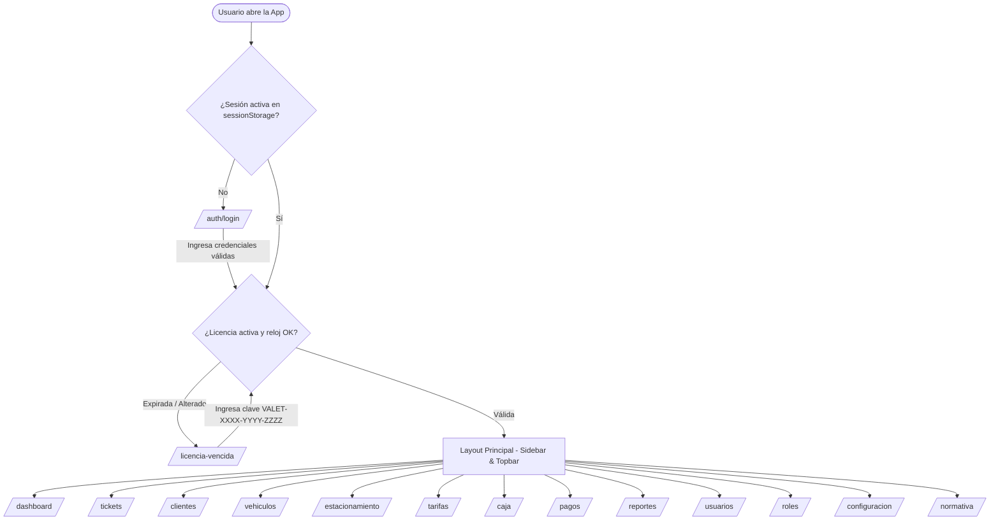
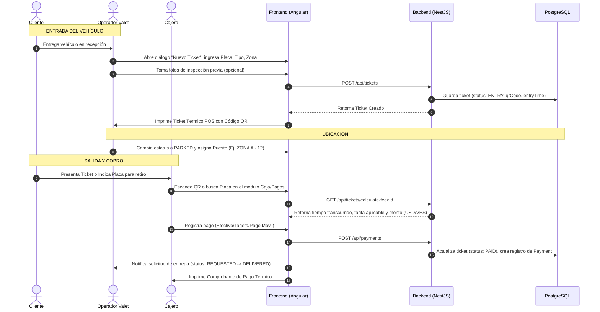

# 4. App Flow & User Navigation
## Parking Valet System v1.0

---

## 1. Mapa de Navegación General

---

## 2. Diagrama de Flujo Operativo: Registro y Cobro de Ticket

---

## 3. Matriz de Acciones por Botón y Ruteo

| Pantalla / Módulo | Elemento UI / Botón | Acción / Evento | Destino / Resultado |
|---|---|---|---|
| `/auth/login` | Botón "Iniciar Sesión" | Valida formulario, envía `POST /api/auth/login` | Guarda JWT en `sessionStorage` y navega a `/dashboard` |
| `/dashboard` | Tarjeta KPI "Tickets Activos" | Click en la tarjeta | Navega a `/tickets?filter=active` |
| `/tickets` | Botón "+ Nuevo Ticket" | Abre diálogo modal de creación | Genera QR e imprime en impresora POS |
| `/tickets` | Botón "Cambiar Estado" | Despliega opciones: Parked, Requested, Delivered | Actualiza estatus y emite notificación |
| `/caja` | Botón "Abrir Caja" | Captura monto inicial en USD y VES | Registra turno activo de caja |
| `/caja` | Botón "Cerrar Caja" | Muestra resumen de recaudación y descuadre | Genera reporte de cierre y bloquea la caja |
| `/reportes` | Botón "Exportar PDF" | Invoca `exportPdf()` en `ReportExportService` | Descarga PDF vectorial con membrete corporativo |
| `/reportes` | Botón "Exportar Excel" | Invoca `exportExcel()` en `ReportExportService` | Descarga libro `.xlsx` nativo de Microsoft Excel |
| `/configuracion` | Tab "Licencia & Suscripción" | Muestra días restantes y formulario de clave | Permite ingresar clave `VALET-XXXX-YYYY-ZZZZ` |
| `/licencia-vencida` | Botón "Activar Licencia" | Envía `POST /api/license/activate` | Si es válida, desbloquea el sistema y redirige |
| Topbar | Botón "Cerrar Sesión" | Invoca `authService.logout()` | Limpia `sessionStorage` y redirige a `/auth/login` |
