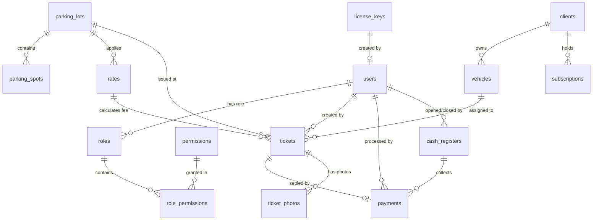

# 5. Backend Schema & Database Architecture
## Parking Valet System v1.0

---

## 1. Diagrama Entidad-Relación (ERD)



---

## 2. Descripción de Modelos en Prisma (`schema.prisma`)

### A. Módulo de Seguridad y Usuarios
- **`User` (`users`)**: Identificador único UUID, correo electrónico, contraseña hasheada (Bcrypt), nombre, apellido, estado (`isActive`), relación con `Role`.
- **`Role` (`roles`)**: Nombre del rol (ej: `ADMIN`, `SUPERVISOR`, `VALET`, `CASHIER`), descripción, lista de relaciones con `RolePermission`.
- **`Permission` (`permissions`)**: Nombre del permiso granular (ej: `tickets:create`, `tickets:update`, `reports:revenue`, `cash:close`).
- **`RolePermission` (`role_permissions`)**: Tabla intermedia que vincula roles con sus respectivos permisos granulares.

### B. Módulo Operativo de Parqueo y Tarifas
- **`ParkingLot` (`parking_lots`)**: Datos de la sede o estacionamiento (nombre, dirección, capacidad total de puestos, estado activo).
- **`ParkingSpot` (`parking_spots`)**: Puestos de estacionamiento individuales vinculados a un lote (número de puesto, zona, estado: `FREE`, `OCCUPIED`, `RESERVED`, `MAINTENANCE`).
- **`Rate` (`rates`)**: Definición de esquemas tarifarios (tarifa por hora, fracción, tarifa plana diaria, hora de gracia, tipo de vehículo).
- **`Vehicle` (`vehicles`)**: Registro de vehículo por placa, marca, modelo, color, tipo (`CAR`, `MOTORCYCLE`, `SUV`, `TRUCK`) e ID del cliente propietario.
- **`Client` (`clients`)**: Registro de clientes (nombre, teléfono, correo, documento de identidad, tipo: `REGULAR`, `FREQUENT`, `VIP`, `SUBSCRIBER`).

### C. Módulo de Tickets y Pagos
- **`Ticket` (`tickets`)**: Registro de ingreso de vehículo (código de ticket, código QR, fecha/hora entrada, fecha/hora salida, estatus: `ENTRY`, `PARKED`, `REQUESTED`, `DELIVERED`, `CANCELLED`, monto total calculado, ID de usuario emisor, ID de puesto).
- **`TicketPhoto` (`ticket_photos`)**: Fotografías tomadas durante la inspección de vehículo al ingreso (URL de foto, etapa: `ENTRY`/`EXIT`, descripción).
- **`Payment` (`payments`)**: Registro de cobro de ticket (monto en USD, monto en VES, tasa de cambio BCV aplicada, método de pago: `CASH`, `CARD`, `TRANSFER`, `SUBSCRIPTION`, `APP`, ID de caja registradora, ID de usuario cajero).
- **`CashRegister` (`cash_registers`)**: Control de cajas turnos (monto inicial, monto final en arqueo, total recaudado en efectivo/tarjeta, fecha apertura, fecha cierre, estado: `OPEN`, `CLOSED`, ID de usuario operador).

### D. Módulo de Licenciamiento y Configuración
- **`LicenseKey` (`license_keys`)**: Control de clave de software (hash de clave SHA-256, clave enmascarada, días de duración = 30, estado: `UNUSED`, `ACTIVE`, `EXPIRED`, fecha de activación, fecha de vencimiento, correo del cliente).
- **`Setting` (`settings`)**: Configuración general clave-valor del sistema (datos de membrete para tickets/reportes, IVA %, impresora predeterminada POS).

---

## 3. Script SQL de Referencia (DDL Simplificado)

```sql
-- TABLA DE CLAVES DE LICENCIA
CREATE TYPE "LicenseKeyStatus" AS ENUM ('UNUSED', 'ACTIVE', 'EXPIRED');

CREATE TABLE "license_keys" (
    "id" UUID PRIMARY KEY DEFAULT gen_random_uuid(),
    "key_hash" VARCHAR(255) UNIQUE NOT NULL,
    "masked_key" VARCHAR(50) NOT NULL,
    "duration_days" INT NOT NULL DEFAULT 30,
    "status" "LicenseKeyStatus" NOT NULL DEFAULT 'UNUSED',
    "client_email" VARCHAR(255),
    "activated_at" TIMESTAMP(3),
    "expires_at" TIMESTAMP(3),
    "created_by" UUID,
    "created_at" TIMESTAMP(3) NOT NULL DEFAULT CURRENT_TIMESTAMP,
    "updated_at" TIMESTAMP(3) NOT NULL
);

CREATE INDEX "idx_license_keys_hash" ON "license_keys"("key_hash");
CREATE INDEX "idx_license_keys_status" ON "license_keys"("status");
```
